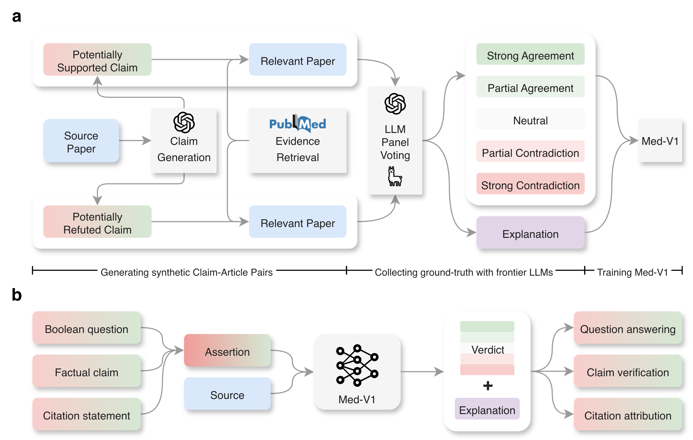

# Med-V1: Small Language Models for Zero-shot and Scalable Biomedical Evidence Attribution

## Overview
Assessing whether an article supports an assertion is essential for hallucination detection and claim verification. While large language models (LLMs) have the potential to automate this task, achieving strong performance requires frontier models such as GPT-5 that are prohibitively expensive to deploy at scale. To efficiently perform biomedical evidence attribution, we present Med-V1, a family of small language models with only three billion parameters. Trained on high-quality synthetic data newly developed in this study, Med-V1 substantially outperforms (+27.0% to +71.3%) its base models on five biomedical benchmarks unified into a verification format. Despite its smaller size, Med-V1 performs comparably to frontier LLMs such as GPT-5, along with high-quality explanations for its predictions. We use Med-V1 to conduct a first-of-its-kind case study that quantifies hallucinations in LLM-generated answers under different citation instructions. Results show that the format instruction strongly affects citation validity and hallucination, with GPT-5 generating more claims but exhibiting hallucination rates similar to GPT-4o. Additionally, we present a second case study showing that Med-V1 can automatically identify high-stakes misattributions in clinical guidelines, revealing potentially negative public health impacts that are otherwise challenging to identify at scale. In conclusion, Med-V1 provides an efficient and accurate lightweight alternative to frontier LLMs for practical and real-world applications in biomedical evidence attribution and verification tasks.

<p align="center">
  
</p>

**Figure 1. Overview of this work.** **a**: MedFact-Synth construction and Med-V1 training. Synthetic claims are generated from source papers and then verified by a panel of LLMs using relevant papers retrieved from PubMed. The resulting verified claim-evidence pairs form the MedFact-Synth dataset, which is then used to train Med-V1 through a combination of supervised fine-tuning and reinforcement learning. **b**: Inference with Med-V1. Given an assertion and a source biomedical article, Med-V1 assesses whether the article supports the assertion. The assertions can be derived from Boolean questions, factual claims, or citation statements, corresponding to the applications of question answering, claim verification, and citation attribution, respectively. Med-V1 outputs both a 5-point Likert rating of agreement and a natural-language explanation of its verdict.

## Use Med-V1
> [!CAUTION]
> Please note that Med-V1 only classifies whether an assertion can be supported by a given source, rather than classifying its factual validity. For example, a "true" claim can still be refuted by an article that shows conflicting data from a small-scale study, and a "false" claim can still be supported by an article that discusses a potential biological mechanism. As such, Med-V1's predictions of support and refutation are entirely dependent on the provided source evidence and should not be interpreted as a universal factuality label. Like all AI models, Med-V1 output can contain inaccuracies and does not reflect the views of the authors or their employers.

### Prerequisites
- Python 3.8+ (3.11.7 is used in the work)
- `torch>=2.1.0` (latest version is recommended)
- `transformers>=4.51.0` (latest version is recommended)

Essentially, Med-V1 verifies an assertion against a source.
The assertion can be a claim about the effectiveness of a treatment, and in this case, the source can be the PubMed abstract reporting the clinical trial that tests the treatment.

There are two variants of Med-V1:
- [Med-V1-L3B](https://huggingface.co/ncbi/Med-V1-L3B), which is [Llama-3.2-3B-Instruct](https://huggingface.co/meta-llama/Llama-3.2-3B-Instruct) fine-tuned with [MedFact-Synth](https://huggingface.co/datasets/ncbi/MedFact-Synth)
- [Med-V1-Q3B](https://huggingface.co/ncbi/Med-V1-Q3B), which is [Qwen2.5-3B-Instruct](https://huggingface.co/Qwen/Qwen2.5-3B-Instruct) fine-tuned with [MedFact-Synth](https://huggingface.co/datasets/ncbi/MedFact-Synth)

They have similar performance in our evaluations, and the demonstrations below will be based on Med-V1-L3B.

### Quick start
Here is a self-contained code snippet for running Med-V1 (script also saved as `./quick_start.py`). You can also try it in [Google Colab](https://colab.research.google.com/drive/1mM8WoE4LUTz27Nmjeb5X-MF3eBWnoI00?usp=sharing). Using a modern GPU (e.g., Nvidia A100), the demonstration run should finish in several seconds once the model is downloaded.

```python
import torch
from transformers import AutoTokenizer, AutoModelForCausalLM, pipeline
import re

model_path = "ncbi/Med-V1-L3B"

# 1. loading the Med-V1(-L3B) model and tokenizer
model = AutoModelForCausalLM.from_pretrained(
    model_path,
    cache_dir="./med_v1_model", # change it accordingly
)
model.eval()

tokenizer = AutoTokenizer.from_pretrained(model_path)

# Ensure pad token is set
if not tokenizer.pad_token:
    tokenizer.pad_token_id = tokenizer.eos_token_id

# 2. Initialize Pipeline
generator = pipeline(
    "text-generation",
    model=model,
    tokenizer=tokenizer,
)

# 3. Preparing the messages
# The official system prompt of Med-V1.
medv1_system_prompt = """You are a fact-checking expert trained in evidence-based medicine. Your task is to evaluate how strongly an *article* agrees or disagrees with a *claim*. The *article* is retrieved from a search engine using the *claim* as the query.

Use the following five-point scale:
   - **-2 Strong Contradiction**  – The article clearly and directly refutes the claim.
   - **-1 Partial Contradiction** – The article provides mixed or indirect evidence against the claim.
   - ** 0 Neutral / Unrelated**   – The article does not address the claim, offers insufficient information, or is irrelevant to the claim.
   - ** 1 Partial Agreement**	 – The article offers some indirect or tentative support for the claim.
   - ** 2 Strong Agreement**	 – The article explicitly and strongly supports the claim.

Note that the *article* might not describe the exact same subjects, interventions, or measurements as the *claim*. In this case, please note the difference and assign a score of 0. 

Output in two parts only and do not output anything else:
<think>[your detailed, step‐by‐step explanation for scoring]</think>
<score>[the integer score only, i.e., -2, -1, 0, 1, or 2]</score>"""

# Put your custom source and assertion into this syntax: f"Article:\n{source}\n\nClaim:\n{assertion}"
medv1_user_prompt = """Article:
Do preoperative statins reduce atrial fibrillation after coronary artery bypass grafting?
Objective: Recent studies have demonstrated that statins have pleiotropic effects, including anti-inflammatory effects and atrial fibrillation (AF) preventive effects. The objective of this study was to assess the efficacy of preoperative statin therapy in preventing AF after coronary artery bypass grafting (CABG).
Methods: 221 patients underwent CABG in our hospital from 2004 to 2007. 14 patients with preoperative AF and 4 patients with concomitant valve surgery were excluded from this study. Patients were divided into two groups to examine the influence of statins: those with preoperative statin therapy (Statin group, n = 77) and those without it (Non-statin group, n = 126). In addition, patients were divided into two groups to determine the independent predictors for postoperative AF: those with postoperative AF (AF group, n = 54) and those without it (Non-AF group, n = 149). Patient data were collected and analyzed retrospectively.
Results: The overall incidence of postoperative AF was 26%. Postoperative AF was significantly lower in the Statin group compared with the Non-statin group (16% versus 33%, p = 0.005). Multivariate analysis demonstrated that independent predictors of AF development after CABG were preoperative statin therapy (odds ratio [OR] 0.327, 95% confidence interval [CI] 0.107 to 0.998, p = 0.05) and age (OR 1.058, 95% CI 1.004 to 1.116, p = 0.035).
Conclusion: Our study indicated that preoperative statin therapy seems to reduce AF development after CABG.

Claim:
Preoperative statins reduce atrial fibrillation after coronary artery bypass grafting."""

messages = [
    {"role": "system", "content": medv1_system_prompt},
    {"role": "user", "content": medv1_user_prompt},
]

# 4. Run the inference
print("Generating response...")
with torch.no_grad():
    completions = generator(
        messages,
        do_sample=False,   # Greedy decoding for deterministic results
        max_new_tokens=1024,
        temperature=None,
        top_p=None
    )

# 5. Extract and Print Results
raw_output = completions[0]["generated_text"][-1]["content"]
print(raw_output)

# Expected output:
# <think>The article directly investigates the relationship between preoperative statin therapy and the incidence of atrial fibrillation (AF) after coronary artery bypass grafting (CABG). The results presented in the article show that the incidence of postoperative AF is significantly lower in patients who received preoperative statin therapy compared to those who did not (16% vs. 33%, p = 0.005). Furthermore, the multivariate analysis identifies preoperative statin therapy as an independent predictor of reduced AF development after CABG (odds ratio 0.327, p = 0.05). This strong evidence supports the claim that preoperative statins reduce atrial fibrillation after CABG. Therefore, the article explicitly and strongly supports the claim. Given this analysis, I would assign a score of 2 for strong agreement.</think>
# <score>2</score>
```

### Batch processing
We also support running Med-V1 in batch mode. To do so, please first preprocess your dataset into a jsonl or json file.
Each line (or entry in the list) should be a dict that contains at least a `system_prompt` key and a `user_prompt` key, which will be used as the input prompts for Med-V1.
Please see the [quick start](https://github.com/ncbi-nlp/Med-V1-Public/tree/main?tab=readme-ov-file#quick-start) for how to prepare the system and user prompts.
You can also include other metadata in each entry, such as the instance index. They will be saved in the output file as well, but will not be used by Med-V1.
An example file is shown below:
```bash
# json also ok
$ head -5 datasets/prompts_example_input_file.jsonl 
{"system_prompt": "You are a fact-checking expert trained in evidence-based medicine. Your task is to evaluate how strongly an *article* agrees or disagrees with a *claim*. The *article* is retrieved from a search engine using the *claim* as the query.\n\nUse the following five-point scale:\n   - **-2 Strong Contradiction**  \u2013 The article clearly and directly refutes the claim.\n   - **-1 Partial Contradiction** \u2013 The article provides mixed or indirect evidence against the claim.\n   - ** 0 Neutral / Unrelated**   \u2013 The article does not address the claim, offers insufficient information, or is irrelevant to the claim.\n   - ** 1 Partial Agreement**\t \u2013 The article offers some indirect or tentative support for the claim.\n   - ** 2 Strong Agreement**\t \u2013 The article explicitly and strongly supports the claim.\n\nNote that the *article* might not describe the exact same subjects, interventions, or measurements as the *claim*. In this case, please note the difference and assign a score of 0. \n\nOutput in two parts only and do not output anything else:\n<think>[your detailed, step\u2010by\u2010step explanation for scoring]</think>\n<score>[the integer score only, i.e., -2, -1, 0, 1, or 2]</score>", "user_prompt": "Article:\nNew opportunities: the use of nanotechnologies to manipulate and track stem cells.\nNanotechnologies are emerging platforms that could be useful in measuring, understanding, and manipulating stem cells. Examples include magnetic nanoparticles and quantum dots for stem cell labeling and in vivo tracking; nanoparticles, carbon nanotubes, and polyplexes for the intracellular delivery of genes/oligonucleotides and protein/peptides; and engineered nanometer-scale scaffolds for stem cell differentiation and transplantation. This review examines the use of nanotechnologies for stem cell tracking, differentiation, and transplantation. We further discuss their utility and the potential concerns regarding their cytotoxicity.\n\nClaim:\n0-dimensional biomaterials show inductive properties."}
{"system_prompt": "You are a fact-checking expert trained in evidence-based medicine. Your task is to evaluate how strongly an *article* agrees or disagrees with a *claim*. The *article* is retrieved from a search engine using the *claim* as the query.\n\nUse the following five-point scale:\n   - **-2 Strong Contradiction**  \u2013 The article clearly and directly refutes the claim.\n   - **-1 Partial Contradiction** \u2013 The article provides mixed or indirect evidence against the claim.\n   - ** 0 Neutral / Unrelated**   \u2013 The article does not address the claim, offers insufficient information, or is irrelevant to the claim.\n   - ** 1 Partial Agreement**\t \u2013 The article offers some indirect or tentative support for the claim.\n   - ** 2 Strong Agreement**\t \u2013 The article explicitly and strongly supports the claim.\n\nNote that the *article* might not describe the exact same subjects, interventions, or measurements as the *claim*. In this case, please note the difference and assign a score of 0. \n\nOutput in two parts only and do not output anything else:\n<think>[your detailed, step\u2010by\u2010step explanation for scoring]</think>\n<score>[the integer score only, i.e., -2, -1, 0, 1, or 2]</score>", "user_prompt": "Article:\nRare Variants Create Synthetic Genome-Wide Associations\nGenome-wide association studies (GWAS) have now identified at least 2,000 common variants that appear associated with common diseases or related traits (http://www.genome.gov/gwastudies), hundreds of which have been convincingly replicated. It is generally thought that the associated markers reflect the effect of a nearby common (minor allele frequency >0.05) causal site, which is associated with the marker, leading to extensive resequencing efforts to find causal sites. We propose as an alternative explanation that variants much less common than the associated one may create \"synthetic associations\" by occurring, stochastically, more often in association with one of the alleles at the common site versus the other allele. Although synthetic associations are an obvious theoretical possibility, they have never been systematically explored as a possible explanation for GWAS findings. Here, we use simple computer simulations to show the conditions under which such synthetic associations will arise and how they may be recognized. We show that they are not only possible, but inevitable, and that under simple but reasonable genetic models, they are likely to account for or contribute to many of the recently identified signals reported in genome-wide association studies. We also illustrate the behavior of synthetic associations in real datasets by showing that rare causal mutations responsible for both hearing loss and sickle cell anemia create genome-wide significant synthetic associations, in the latter case extending over a 2.5-Mb interval encompassing scores of \"blocks\" of associated variants. In conclusion, uncommon or rare genetic variants can easily create synthetic associations that are credited to common variants, and this possibility requires careful consideration in the interpretation and follow up of GWAS signals.\n\nClaim:\n1,000 genomes project enables mapping of genetic sequence variation consisting of rare variants with larger penetrance effects than common variants."}
{"system_prompt": "You are a fact-checking expert trained in evidence-based medicine. Your task is to evaluate how strongly an *article* agrees or disagrees with a *claim*. The *article* is retrieved from a search engine using the *claim* as the query.\n\nUse the following five-point scale:\n   - **-2 Strong Contradiction**  \u2013 The article clearly and directly refutes the claim.\n   - **-1 Partial Contradiction** \u2013 The article provides mixed or indirect evidence against the claim.\n   - ** 0 Neutral / Unrelated**   \u2013 The article does not address the claim, offers insufficient information, or is irrelevant to the claim.\n   - ** 1 Partial Agreement**\t \u2013 The article offers some indirect or tentative support for the claim.\n   - ** 2 Strong Agreement**\t \u2013 The article explicitly and strongly supports the claim.\n\nNote that the *article* might not describe the exact same subjects, interventions, or measurements as the *claim*. In this case, please note the difference and assign a score of 0. \n\nOutput in two parts only and do not output anything else:\n<think>[your detailed, step\u2010by\u2010step explanation for scoring]</think>\n<score>[the integer score only, i.e., -2, -1, 0, 1, or 2]</score>", "user_prompt": "Article:\nPrevalent abnormal prion protein in human appendixes after bovine spongiform encephalopathy epizootic: large scale survey\nOBJECTIVES To carry out a further survey of archived appendix samples to understand better the differences between existing estimates of the prevalence of subclinical infection with prions after the bovine spongiform encephalopathy epizootic and to see whether a broader birth cohort was affected, and to understand better the implications for the management of blood and blood products and for the handling of surgical instruments.   \n DESIGN Irreversibly unlinked and anonymised large scale survey of archived appendix samples.   \n SETTING Archived appendix samples from the pathology departments of 41 UK hospitals participating in the earlier survey, and additional hospitals in regions with lower levels of participation in that survey.    SAMPLE 32,441 archived appendix samples fixed in formalin and embedded in paraffin and tested for the presence of abnormal prion protein (PrP).   \n RESULTS Of the 32,441 appendix samples 16 were positive for abnormal PrP, indicating an overall prevalence of 493 per million population (95% confidence interval 282 to 801 per million). The prevalence in those born in 1941-60 (733 per million, 269 to 1596 per million) did not differ significantly from those born between 1961 and 1985 (412 per million, 198 to 758 per million) and was similar in both sexes and across the three broad geographical areas sampled. Genetic testing of the positive specimens for the genotype at PRNP codon 129 revealed a high proportion that were valine homozygous compared with the frequency in the normal population, and in stark contrast with confirmed clinical cases of vCJD, all of which were methionine homozygous at PRNP codon 129.   \n CONCLUSIONS This study corroborates previous studies and suggests a high prevalence of infection with abnormal PrP, indicating vCJD carrier status in the population compared with the 177 vCJD cases to date. These findings have important implications for the management of blood and blood products and for the handling of surgical instruments.\n\nClaim:\n1/2000 in UK have abnormal PrP positivity."}
{"system_prompt": "You are a fact-checking expert trained in evidence-based medicine. Your task is to evaluate how strongly an *article* agrees or disagrees with a *claim*. The *article* is retrieved from a search engine using the *claim* as the query.\n\nUse the following five-point scale:\n   - **-2 Strong Contradiction**  \u2013 The article clearly and directly refutes the claim.\n   - **-1 Partial Contradiction** \u2013 The article provides mixed or indirect evidence against the claim.\n   - ** 0 Neutral / Unrelated**   \u2013 The article does not address the claim, offers insufficient information, or is irrelevant to the claim.\n   - ** 1 Partial Agreement**\t \u2013 The article offers some indirect or tentative support for the claim.\n   - ** 2 Strong Agreement**\t \u2013 The article explicitly and strongly supports the claim.\n\nNote that the *article* might not describe the exact same subjects, interventions, or measurements as the *claim*. In this case, please note the difference and assign a score of 0. \n\nOutput in two parts only and do not output anything else:\n<think>[your detailed, step\u2010by\u2010step explanation for scoring]</think>\n<score>[the integer score only, i.e., -2, -1, 0, 1, or 2]</score>", "user_prompt": "Article:\nEstimates of global prevalence of childhood underweight in 1990 and 2015.\nCONTEXT One key target of the United Nations Millennium Development goals is to reduce the prevalence of underweight among children younger than 5 years by half between 1990 and 2015.   \n OBJECTIVE To estimate trends in childhood underweight by geographic regions of the world.   \n DESIGN, SETTING, AND PARTICIPANTS Time series study of prevalence of underweight, defined as weight 2 SDs below the mean weight for age of the National Center for Health Statistics and World Health Organization (WHO) reference population. National prevalence rates derived from the WHO Global Database on Child Growth and Malnutrition, which includes data on approximately 31 million children younger than 5 years who participated in 419 national nutritional surveys in 139 countries from 1965 through 2002.   \n MAIN OUTCOME MEASURES Linear mixed-effects modeling was used to estimate prevalence rates and numbers of underweight children by region in 1990 and 2015 and to calculate the changes (ie, increase or decrease) to these values between 1990 and 2015.   \n RESULTS Worldwide, underweight prevalence was projected to decline from 26.5% in 1990 to 17.6% in 2015, a change of -34% (95% confidence interval [CI], -43% to -23%). In developed countries, the prevalence was estimated to decrease from 1.6% to 0.9%, a change of -41% (95% CI, -92% to 343%). In developing regions, the prevalence was forecasted to decline from 30.2% to 19.3%, a change of -36% (95% CI, -45% to -26%). In Africa, the prevalence of underweight was forecasted to increase from 24.0% to 26.8%, a change of 12% (95% CI, 8%-16%). In Asia, the prevalence was estimated to decrease from 35.1% to 18.5%, a change of -47% (95% CI, -58% to -34%). Worldwide, the number of underweight children was projected to decline from 163.8 million in 1990 to 113.4 million in 2015, a change of -31% (95% CI, -40% to -20%). Numbers are projected to decrease in all subregions except the subregions of sub-Saharan, Eastern, Middle, and Western Africa, which are expected to experience substantial increases in the number of underweight children.   \n CONCLUSIONS An overall improvement in the global situation is anticipated; however, neither the world as a whole, nor the developing regions, are expected to achieve the Millennium Development goals. This is largely due to the deteriorating situation in Africa where all subregions, except Northern Africa, are expected to fail to meet the goal.\n\nClaim:\n5% of perinatal mortality is due to low birth weight."}
{"system_prompt": "You are a fact-checking expert trained in evidence-based medicine. Your task is to evaluate how strongly an *article* agrees or disagrees with a *claim*. The *article* is retrieved from a search engine using the *claim* as the query.\n\nUse the following five-point scale:\n   - **-2 Strong Contradiction**  \u2013 The article clearly and directly refutes the claim.\n   - **-1 Partial Contradiction** \u2013 The article provides mixed or indirect evidence against the claim.\n   - ** 0 Neutral / Unrelated**   \u2013 The article does not address the claim, offers insufficient information, or is irrelevant to the claim.\n   - ** 1 Partial Agreement**\t \u2013 The article offers some indirect or tentative support for the claim.\n   - ** 2 Strong Agreement**\t \u2013 The article explicitly and strongly supports the claim.\n\nNote that the *article* might not describe the exact same subjects, interventions, or measurements as the *claim*. In this case, please note the difference and assign a score of 0. \n\nOutput in two parts only and do not output anything else:\n<think>[your detailed, step\u2010by\u2010step explanation for scoring]</think>\n<score>[the integer score only, i.e., -2, -1, 0, 1, or 2]</score>", "user_prompt": "Article:\nFolic acid improves endothelial function in coronary artery disease via mechanisms largely independent of homocysteine lowering.\nBACKGROUND Homocysteine is a risk factor for coronary artery disease (CAD), although a causal relation remains to be proven. The importance of determining direct causality rests in the fact that plasma homocysteine can be safely and inexpensively reduced by 25% with folic acid. This reduction is maximally achieved by doses of 0.4 mg/d. High-dose folic acid (5 mg/d) improves endothelial function in CAD, although the mechanism is controversial. It has been proposed that improvement occurs through reduction in total (tHcy) or free (non-protein bound) homocysteine (fHcy). We investigated the effects of folic acid on endothelial function before a change in homocysteine in patients with CAD.   \n METHODS AND RESULTS A randomized, placebo-controlled study of folic acid (5 mg/d) for 6 weeks was undertaken in 33 patients. Endothelial function, assessed by flow-mediated dilatation (FMD), was measured before, at 2 and 4 hours after the first dose of folic acid, and after 6 weeks of treatment. Plasma folate increased markedly by 1 hour (200 compared with 25.8 nmol/L; P<0.001). FMD improved at 2 hours (83 compared with 47 microm; P<0.001) and was largely complete by 4 hours (101 compared with 51 microm; P<0.001). tHcy did not significantly differ acutely (4-hour tHcy, 9.56 compared with 9.79 micromol/L; P=NS). fHcy did not differ at 3 hours but was slightly reduced at 4 hours (1.55 compared with 1.78 micromol/L; P=0.02). FMD improvement did not correlate with reductions in either fHcy or tHcy at any time.   \n CONCLUSIONS These data suggest that folic acid improves endothelial function in CAD acutely by a mechanism largely independent of homocysteine.\n\nClaim:\nA deficiency of vitamin B12 increases blood levels of homocysteine."}
```

Alternatively, if you don't want to prepare the `system_prompt` and `user_prompt` keys, each line (entry) should contain a `claim` key and a `source` key, and the `utils.py` will automatically add the Med-V1 prompts.
An example file is shown below:
```bash
# jsonl also ok
$ head datasets/claim_source_example_input_file.json 
[
    {
        "claim": "0-dimensional biomaterials show inductive properties.",
        "source": "New opportunities: the use of nanotechnologies to manipulate and track stem cells.\nNanotechnologies are emerging platforms that could be useful in measuring, understanding, and manipulating stem cells. Examples include magnetic nanoparticles and quantum dots for stem cell labeling and in vivo tracking; nanoparticles, carbon nanotubes, and polyplexes for the intracellular delivery of genes/oligonucleotides and protein/peptides; and engineered nanometer-scale scaffolds for stem cell differentiation and transplantation. This review examines the use of nanotechnologies for stem cell tracking, differentiation, and transplantation. We further discuss their utility and the potential concerns regarding their cytotoxicity."
    },
    {
        "claim": "1,000 genomes project enables mapping of genetic sequence variation consisting of rare variants with larger penetrance effects than common variants.",
        "source": "Rare Variants Create Synthetic Genome-Wide Associations\nGenome-wide association studies (GWAS) have now identified at least 2,000 common variants that appear associated with common diseases or related traits (http://www.genome.gov/gwastudies), hundreds of which have been convincingly replicated. It is generally thought that the associated markers reflect the effect of a nearby common (minor allele frequency >0.05) causal site, which is associated with the marker, leading to extensive resequencing efforts to find causal sites. We propose as an alternative explanation that variants much less common than the associated one may create \"synthetic associations\" by occurring, stochastically, more often in association with one of the alleles at the common site versus the other allele. Although synthetic associations are an obvious theoretical possibility, they have never been systematically explored as a possible explanation for GWAS findings. Here, we use simple computer simulations to show the conditions under which such synthetic associations will arise and how they may be recognized. We show that they are not only possible, but inevitable, and that under simple but reasonable genetic models, they are likely to account for or contribute to many of the recently identified signals reported in genome-wide association studies. We also illustrate the behavior of synthetic associations in real datasets by showing that rare causal mutations responsible for both hearing loss and sickle cell anemia create genome-wide significant synthetic associations, in the latter case extending over a 2.5-Mb interval encompassing scores of \"blocks\" of associated variants. In conclusion, uncommon or rare genetic variants can easily create synthetic associations that are credited to common variants, and this possibility requires careful consideration in the interpretation and follow up of GWAS signals."
    },
    {
```

Once the input file is ready, you can run Med-V1 by:
```bash
python --input_path datasets/claim_source_example_input_file.json --output_path results/claim_source_example_output_file.jsonl --model_path ncbi/Med-V1-L3B
# or the other input
python --input_path datasets/prompts_example_input_file.jsonl --output_path results/prompts_example_output_file.jsonl --model_path ncbi/Med-V1-L3B
```

The output will be saved in the specified `results` folder:
```bash
$ head -n 5 results/claim_source_example_output_file.jsonl
{"_file_idx": "0", "raw_output": "<think>The article discusses the use of nanotechnologies in manipulating and tracking stem cells, including the use of nanoparticles, carbon nanotubes, and polyplexes. However, it does not specifically mention \"0-dimensional biomaterials\" or their inductive properties. The article focuses on the applications of various nanotechnologies in stem cell biology, but it does not provide direct information about the properties of 0-dimensional biomaterials. Since the article does not address the claim directly, and the subjects are not exactly the same, the score should reflect the lack of relevant information.</think>\n<score>0</score>", "extracted_rationale": "The article discusses the use of nanotechnologies in manipulating and tracking stem cells, including the use of nanoparticles, carbon nanotubes, and polyplexes. However, it does not specifically mention \"0-dimensional biomaterials\" or their inductive properties. The article focuses on the applications of various nanotechnologies in stem cell biology, but it does not provide direct information about the properties of 0-dimensional biomaterials. Since the article does not address the claim directly, and the subjects are not exactly the same, the score should reflect the lack of relevant information.", "extracted_score": 0, "claim": "0-dimensional biomaterials show inductive properties.", "source": "New opportunities: the use of nanotechnologies to manipulate and track stem cells.\nNanotechnologies are emerging platforms that could be useful in measuring, understanding, and manipulating stem cells. Examples include magnetic nanoparticles and quantum dots for stem cell labeling and in vivo tracking; nanoparticles, carbon nanotubes, and polyplexes for the intracellular delivery of genes/oligonucleotides and protein/peptides; and engineered nanometer-scale scaffolds for stem cell differentiation and transplantation. This review examines the use of nanotechnologies for stem cell tracking, differentiation, and transplantation. We further discuss their utility and the potential concerns regarding their cytotoxicity.", "system_prompt": "You are a fact-checking expert trained in evidence-based medicine. Your task is to evaluate how strongly an *article* agrees or disagrees with a *claim*. The *article* is retrieved from a search engine using the *claim* as the query.\n\nUse the following five-point scale:\n   - **-2 Strong Contradiction**  \u2013 The article clearly and directly refutes the claim.\n   - **-1 Partial Contradiction** \u2013 The article provides mixed or indirect evidence against the claim.\n   - ** 0 Neutral / Unrelated**   \u2013 The article does not address the claim, offers insufficient information, or is irrelevant to the claim.\n   - ** 1 Partial Agreement**\t \u2013 The article offers some indirect or tentative support for the claim.\n   - ** 2 Strong Agreement**\t \u2013 The article explicitly and strongly supports the claim.\n\nNote that the *article* might not describe the exact same subjects, interventions, or measurements as the *claim*. In this case, please note the difference and assign a score of 0. \n\nOutput in two parts only and do not output anything else:\n<think>[your detailed, step\u2010by\u2010step explanation for scoring]</think>\n<score>[the integer score only, i.e., -2, -1, 0, 1, or 2]</score>", "user_prompt": "Article:\nNew opportunities: the use of nanotechnologies to manipulate and track stem cells.\nNanotechnologies are emerging platforms that could be useful in measuring, understanding, and manipulating stem cells. Examples include magnetic nanoparticles and quantum dots for stem cell labeling and in vivo tracking; nanoparticles, carbon nanotubes, and polyplexes for the intracellular delivery of genes/oligonucleotides and protein/peptides; and engineered nanometer-scale scaffolds for stem cell differentiation and transplantation. This review examines the use of nanotechnologies for stem cell tracking, differentiation, and transplantation. We further discuss their utility and the potential concerns regarding their cytotoxicity.\n\nClaim:\n0-dimensional biomaterials show inductive properties."}
{"_file_idx": "1", "raw_output": "<think>The article discusses the concept of synthetic genome-wide associations in the context of genome-wide association studies (GWAS) and how rare variants can create associations that are often attributed to common variants. However, it does not specifically address the claim about the 1,000 genomes project or the mapping of genetic sequence variation with larger penetrance effects of rare variants compared to common ones. The article focuses more on the theoretical possibility of synthetic associations rather than providing direct evidence or support for the claim regarding the 1,000 genomes project. Therefore, the article does not provide sufficient information to support or contradict the claim directly. It is more neutral regarding the specific assertion made in the claim.</think>\n<score>0</score>", "extracted_rationale": "The article discusses the concept of synthetic genome-wide associations in the context of genome-wide association studies (GWAS) and how rare variants can create associations that are often attributed to common variants. However, it does not specifically address the claim about the 1,000 genomes project or the mapping of genetic sequence variation with larger penetrance effects of rare variants compared to common ones. The article focuses more on the theoretical possibility of synthetic associations rather than providing direct evidence or support for the claim regarding the 1,000 genomes project. Therefore, the article does not provide sufficient information to support or contradict the claim directly. It is more neutral regarding the specific assertion made in the claim.", "extracted_score": 0, "claim": "1,000 genomes project enables mapping of genetic sequence variation consisting of rare variants with larger penetrance effects than common variants.", "source": "Rare Variants Create Synthetic Genome-Wide Associations\nGenome-wide association studies (GWAS) have now identified at least 2,000 common variants that appear associated with common diseases or related traits (http://www.genome.gov/gwastudies), hundreds of which have been convincingly replicated. It is generally thought that the associated markers reflect the effect of a nearby common (minor allele frequency >0.05) causal site, which is associated with the marker, leading to extensive resequencing efforts to find causal sites. We propose as an alternative explanation that variants much less common than the associated one may create \"synthetic associations\" by occurring, stochastically, more often in association with one of the alleles at the common site versus the other allele. Although synthetic associations are an obvious theoretical possibility, they have never been systematically explored as a possible explanation for GWAS findings. Here, we use simple computer simulations to show the conditions under which such synthetic associations will arise and how they may be recognized. We show that they are not only possible, but inevitable, and that under simple but reasonable genetic models, they are likely to account for or contribute to many of the recently identified signals reported in genome-wide association studies. We also illustrate the behavior of synthetic associations in real datasets by showing that rare causal mutations responsible for both hearing loss and sickle cell anemia create genome-wide significant synthetic associations, in the latter case extending over a 2.5-Mb interval encompassing scores of \"blocks\" of associated variants. In conclusion, uncommon or rare genetic variants can easily create synthetic associations that are credited to common variants, and this possibility requires careful consideration in the interpretation and follow up of GWAS signals.", "system_prompt": "You are a fact-checking expert trained in evidence-based medicine. Your task is to evaluate how strongly an *article* agrees or disagrees with a *claim*. The *article* is retrieved from a search engine using the *claim* as the query.\n\nUse the following five-point scale:\n   - **-2 Strong Contradiction**  \u2013 The article clearly and directly refutes the claim.\n   - **-1 Partial Contradiction** \u2013 The article provides mixed or indirect evidence against the claim.\n   - ** 0 Neutral / Unrelated**   \u2013 The article does not address the claim, offers insufficient information, or is irrelevant to the claim.\n   - ** 1 Partial Agreement**\t \u2013 The article offers some indirect or tentative support for the claim.\n   - ** 2 Strong Agreement**\t \u2013 The article explicitly and strongly supports the claim.\n\nNote that the *article* might not describe the exact same subjects, interventions, or measurements as the *claim*. In this case, please note the difference and assign a score of 0. \n\nOutput in two parts only and do not output anything else:\n<think>[your detailed, step\u2010by\u2010step explanation for scoring]</think>\n<score>[the integer score only, i.e., -2, -1, 0, 1, or 2]</score>", "user_prompt": "Article:\nRare Variants Create Synthetic Genome-Wide Associations\nGenome-wide association studies (GWAS) have now identified at least 2,000 common variants that appear associated with common diseases or related traits (http://www.genome.gov/gwastudies), hundreds of which have been convincingly replicated. It is generally thought that the associated markers reflect the effect of a nearby common (minor allele frequency >0.05) causal site, which is associated with the marker, leading to extensive resequencing efforts to find causal sites. We propose as an alternative explanation that variants much less common than the associated one may create \"synthetic associations\" by occurring, stochastically, more often in association with one of the alleles at the common site versus the other allele. Although synthetic associations are an obvious theoretical possibility, they have never been systematically explored as a possible explanation for GWAS findings. Here, we use simple computer simulations to show the conditions under which such synthetic associations will arise and how they may be recognized. We show that they are not only possible, but inevitable, and that under simple but reasonable genetic models, they are likely to account for or contribute to many of the recently identified signals reported in genome-wide association studies. We also illustrate the behavior of synthetic associations in real datasets by showing that rare causal mutations responsible for both hearing loss and sickle cell anemia create genome-wide significant synthetic associations, in the latter case extending over a 2.5-Mb interval encompassing scores of \"blocks\" of associated variants. In conclusion, uncommon or rare genetic variants can easily create synthetic associations that are credited to common variants, and this possibility requires careful consideration in the interpretation and follow up of GWAS signals.\n\nClaim:\n1,000 genomes project enables mapping of genetic sequence variation consisting of rare variants with larger penetrance effects than common variants."}
{"_file_idx": "2", "raw_output": "<think>The article discusses a study that found an overall prevalence of abnormal prion protein (PrP) in archived appendix samples from the UK population. The results indicate that out of 32,441 samples, 16 were positive for abnormal PrP, which translates to a prevalence of 493 per million population. To convert this to a more common format, that would equate to approximately 1 in 200,000. The claim states that \"1/2000 in UK have abnormal PrP positivity,\" which implies a higher prevalence than what the article reports. Therefore, the article does not support the claim that 1 in 2000 has abnormal PrP positivity, as it indicates a much lower prevalence. The article provides specific data that contradicts the claim, leading to a strong contradiction.</think>\n<score>-2</score>", "extracted_rationale": "The article discusses a study that found an overall prevalence of abnormal prion protein (PrP) in archived appendix samples from the UK population. The results indicate that out of 32,441 samples, 16 were positive for abnormal PrP, which translates to a prevalence of 493 per million population. To convert this to a more common format, that would equate to approximately 1 in 200,000. The claim states that \"1/2000 in UK have abnormal PrP positivity,\" which implies a higher prevalence than what the article reports. Therefore, the article does not support the claim that 1 in 2000 has abnormal PrP positivity, as it indicates a much lower prevalence. The article provides specific data that contradicts the claim, leading to a strong contradiction.", "extracted_score": -2, "claim": "1/2000 in UK have abnormal PrP positivity.", "source": "Prevalent abnormal prion protein in human appendixes after bovine spongiform encephalopathy epizootic: large scale survey\nOBJECTIVES To carry out a further survey of archived appendix samples to understand better the differences between existing estimates of the prevalence of subclinical infection with prions after the bovine spongiform encephalopathy epizootic and to see whether a broader birth cohort was affected, and to understand better the implications for the management of blood and blood products and for the handling of surgical instruments.   \n DESIGN Irreversibly unlinked and anonymised large scale survey of archived appendix samples.   \n SETTING Archived appendix samples from the pathology departments of 41 UK hospitals participating in the earlier survey, and additional hospitals in regions with lower levels of participation in that survey.    SAMPLE 32,441 archived appendix samples fixed in formalin and embedded in paraffin and tested for the presence of abnormal prion protein (PrP).   \n RESULTS Of the 32,441 appendix samples 16 were positive for abnormal PrP, indicating an overall prevalence of 493 per million population (95% confidence interval 282 to 801 per million). The prevalence in those born in 1941-60 (733 per million, 269 to 1596 per million) did not differ significantly from those born between 1961 and 1985 (412 per million, 198 to 758 per million) and was similar in both sexes and across the three broad geographical areas sampled. Genetic testing of the positive specimens for the genotype at PRNP codon 129 revealed a high proportion that were valine homozygous compared with the frequency in the normal population, and in stark contrast with confirmed clinical cases of vCJD, all of which were methionine homozygous at PRNP codon 129.   \n CONCLUSIONS This study corroborates previous studies and suggests a high prevalence of infection with abnormal PrP, indicating vCJD carrier status in the population compared with the 177 vCJD cases to date. These findings have important implications for the management of blood and blood products and for the handling of surgical instruments.", "system_prompt": "You are a fact-checking expert trained in evidence-based medicine. Your task is to evaluate how strongly an *article* agrees or disagrees with a *claim*. The *article* is retrieved from a search engine using the *claim* as the query.\n\nUse the following five-point scale:\n   - **-2 Strong Contradiction**  \u2013 The article clearly and directly refutes the claim.\n   - **-1 Partial Contradiction** \u2013 The article provides mixed or indirect evidence against the claim.\n   - ** 0 Neutral / Unrelated**   \u2013 The article does not address the claim, offers insufficient information, or is irrelevant to the claim.\n   - ** 1 Partial Agreement**\t \u2013 The article offers some indirect or tentative support for the claim.\n   - ** 2 Strong Agreement**\t \u2013 The article explicitly and strongly supports the claim.\n\nNote that the *article* might not describe the exact same subjects, interventions, or measurements as the *claim*. In this case, please note the difference and assign a score of 0. \n\nOutput in two parts only and do not output anything else:\n<think>[your detailed, step\u2010by\u2010step explanation for scoring]</think>\n<score>[the integer score only, i.e., -2, -1, 0, 1, or 2]</score>", "user_prompt": "Article:\nPrevalent abnormal prion protein in human appendixes after bovine spongiform encephalopathy epizootic: large scale survey\nOBJECTIVES To carry out a further survey of archived appendix samples to understand better the differences between existing estimates of the prevalence of subclinical infection with prions after the bovine spongiform encephalopathy epizootic and to see whether a broader birth cohort was affected, and to understand better the implications for the management of blood and blood products and for the handling of surgical instruments.   \n DESIGN Irreversibly unlinked and anonymised large scale survey of archived appendix samples.   \n SETTING Archived appendix samples from the pathology departments of 41 UK hospitals participating in the earlier survey, and additional hospitals in regions with lower levels of participation in that survey.    SAMPLE 32,441 archived appendix samples fixed in formalin and embedded in paraffin and tested for the presence of abnormal prion protein (PrP).   \n RESULTS Of the 32,441 appendix samples 16 were positive for abnormal PrP, indicating an overall prevalence of 493 per million population (95% confidence interval 282 to 801 per million). The prevalence in those born in 1941-60 (733 per million, 269 to 1596 per million) did not differ significantly from those born between 1961 and 1985 (412 per million, 198 to 758 per million) and was similar in both sexes and across the three broad geographical areas sampled. Genetic testing of the positive specimens for the genotype at PRNP codon 129 revealed a high proportion that were valine homozygous compared with the frequency in the normal population, and in stark contrast with confirmed clinical cases of vCJD, all of which were methionine homozygous at PRNP codon 129.   \n CONCLUSIONS This study corroborates previous studies and suggests a high prevalence of infection with abnormal PrP, indicating vCJD carrier status in the population compared with the 177 vCJD cases to date. These findings have important implications for the management of blood and blood products and for the handling of surgical instruments.\n\nClaim:\n1/2000 in UK have abnormal PrP positivity."}
{"_file_idx": "3", "raw_output": "<think>The article discusses the global prevalence of childhood underweight in 1990 and 2015, while the claim is about the percentage of perinatal mortality due to low birth weight. The article does not address perinatal mortality or low birth weight, and instead focuses on the prevalence of underweight in children younger than 5 years. The subjects, interventions, and measurements in the article are different from those in the claim. Therefore, the article does not provide any information that agrees or disagrees with the claim, and the score should be 0, indicating that the article is neutral or unrelated to the claim.</think>\n<score>0</score>", "extracted_rationale": "The article discusses the global prevalence of childhood underweight in 1990 and 2015, while the claim is about the percentage of perinatal mortality due to low birth weight. The article does not address perinatal mortality or low birth weight, and instead focuses on the prevalence of underweight in children younger than 5 years. The subjects, interventions, and measurements in the article are different from those in the claim. Therefore, the article does not provide any information that agrees or disagrees with the claim, and the score should be 0, indicating that the article is neutral or unrelated to the claim.", "extracted_score": 0, "claim": "5% of perinatal mortality is due to low birth weight.", "source": "Estimates of global prevalence of childhood underweight in 1990 and 2015.\nCONTEXT One key target of the United Nations Millennium Development goals is to reduce the prevalence of underweight among children younger than 5 years by half between 1990 and 2015.   \n OBJECTIVE To estimate trends in childhood underweight by geographic regions of the world.   \n DESIGN, SETTING, AND PARTICIPANTS Time series study of prevalence of underweight, defined as weight 2 SDs below the mean weight for age of the National Center for Health Statistics and World Health Organization (WHO) reference population. National prevalence rates derived from the WHO Global Database on Child Growth and Malnutrition, which includes data on approximately 31 million children younger than 5 years who participated in 419 national nutritional surveys in 139 countries from 1965 through 2002.   \n MAIN OUTCOME MEASURES Linear mixed-effects modeling was used to estimate prevalence rates and numbers of underweight children by region in 1990 and 2015 and to calculate the changes (ie, increase or decrease) to these values between 1990 and 2015.   \n RESULTS Worldwide, underweight prevalence was projected to decline from 26.5% in 1990 to 17.6% in 2015, a change of -34% (95% confidence interval [CI], -43% to -23%). In developed countries, the prevalence was estimated to decrease from 1.6% to 0.9%, a change of -41% (95% CI, -92% to 343%). In developing regions, the prevalence was forecasted to decline from 30.2% to 19.3%, a change of -36% (95% CI, -45% to -26%). In Africa, the prevalence of underweight was forecasted to increase from 24.0% to 26.8%, a change of 12% (95% CI, 8%-16%). In Asia, the prevalence was estimated to decrease from 35.1% to 18.5%, a change of -47% (95% CI, -58% to -34%). Worldwide, the number of underweight children was projected to decline from 163.8 million in 1990 to 113.4 million in 2015, a change of -31% (95% CI, -40% to -20%). Numbers are projected to decrease in all subregions except the subregions of sub-Saharan, Eastern, Middle, and Western Africa, which are expected to experience substantial increases in the number of underweight children.   \n CONCLUSIONS An overall improvement in the global situation is anticipated; however, neither the world as a whole, nor the developing regions, are expected to achieve the Millennium Development goals. This is largely due to the deteriorating situation in Africa where all subregions, except Northern Africa, are expected to fail to meet the goal.", "system_prompt": "You are a fact-checking expert trained in evidence-based medicine. Your task is to evaluate how strongly an *article* agrees or disagrees with a *claim*. The *article* is retrieved from a search engine using the *claim* as the query.\n\nUse the following five-point scale:\n   - **-2 Strong Contradiction**  \u2013 The article clearly and directly refutes the claim.\n   - **-1 Partial Contradiction** \u2013 The article provides mixed or indirect evidence against the claim.\n   - ** 0 Neutral / Unrelated**   \u2013 The article does not address the claim, offers insufficient information, or is irrelevant to the claim.\n   - ** 1 Partial Agreement**\t \u2013 The article offers some indirect or tentative support for the claim.\n   - ** 2 Strong Agreement**\t \u2013 The article explicitly and strongly supports the claim.\n\nNote that the *article* might not describe the exact same subjects, interventions, or measurements as the *claim*. In this case, please note the difference and assign a score of 0. \n\nOutput in two parts only and do not output anything else:\n<think>[your detailed, step\u2010by\u2010step explanation for scoring]</think>\n<score>[the integer score only, i.e., -2, -1, 0, 1, or 2]</score>", "user_prompt": "Article:\nEstimates of global prevalence of childhood underweight in 1990 and 2015.\nCONTEXT One key target of the United Nations Millennium Development goals is to reduce the prevalence of underweight among children younger than 5 years by half between 1990 and 2015.   \n OBJECTIVE To estimate trends in childhood underweight by geographic regions of the world.   \n DESIGN, SETTING, AND PARTICIPANTS Time series study of prevalence of underweight, defined as weight 2 SDs below the mean weight for age of the National Center for Health Statistics and World Health Organization (WHO) reference population. National prevalence rates derived from the WHO Global Database on Child Growth and Malnutrition, which includes data on approximately 31 million children younger than 5 years who participated in 419 national nutritional surveys in 139 countries from 1965 through 2002.   \n MAIN OUTCOME MEASURES Linear mixed-effects modeling was used to estimate prevalence rates and numbers of underweight children by region in 1990 and 2015 and to calculate the changes (ie, increase or decrease) to these values between 1990 and 2015.   \n RESULTS Worldwide, underweight prevalence was projected to decline from 26.5% in 1990 to 17.6% in 2015, a change of -34% (95% confidence interval [CI], -43% to -23%). In developed countries, the prevalence was estimated to decrease from 1.6% to 0.9%, a change of -41% (95% CI, -92% to 343%). In developing regions, the prevalence was forecasted to decline from 30.2% to 19.3%, a change of -36% (95% CI, -45% to -26%). In Africa, the prevalence of underweight was forecasted to increase from 24.0% to 26.8%, a change of 12% (95% CI, 8%-16%). In Asia, the prevalence was estimated to decrease from 35.1% to 18.5%, a change of -47% (95% CI, -58% to -34%). Worldwide, the number of underweight children was projected to decline from 163.8 million in 1990 to 113.4 million in 2015, a change of -31% (95% CI, -40% to -20%). Numbers are projected to decrease in all subregions except the subregions of sub-Saharan, Eastern, Middle, and Western Africa, which are expected to experience substantial increases in the number of underweight children.   \n CONCLUSIONS An overall improvement in the global situation is anticipated; however, neither the world as a whole, nor the developing regions, are expected to achieve the Millennium Development goals. This is largely due to the deteriorating situation in Africa where all subregions, except Northern Africa, are expected to fail to meet the goal.\n\nClaim:\n5% of perinatal mortality is due to low birth weight."}
{"_file_idx": "4", "raw_output": "<think>The article discusses the effects of folic acid on endothelial function in patients with coronary artery disease (CAD) and its relationship with homocysteine levels. It does not mention vitamin B12 or its role in homocysteine levels. The claim specifically states that a deficiency of vitamin B12 increases blood levels of homocysteine, which is not addressed in the article. Since the article does not provide any information relevant to the claim about vitamin B12 and homocysteine, it is considered unrelated. Therefore, the appropriate score is 0.</think>\n<score>0</score>", "extracted_rationale": "The article discusses the effects of folic acid on endothelial function in patients with coronary artery disease (CAD) and its relationship with homocysteine levels. It does not mention vitamin B12 or its role in homocysteine levels. The claim specifically states that a deficiency of vitamin B12 increases blood levels of homocysteine, which is not addressed in the article. Since the article does not provide any information relevant to the claim about vitamin B12 and homocysteine, it is considered unrelated. Therefore, the appropriate score is 0.", "extracted_score": 0, "claim": "A deficiency of vitamin B12 increases blood levels of homocysteine.", "source": "Folic acid improves endothelial function in coronary artery disease via mechanisms largely independent of homocysteine lowering.\nBACKGROUND Homocysteine is a risk factor for coronary artery disease (CAD), although a causal relation remains to be proven. The importance of determining direct causality rests in the fact that plasma homocysteine can be safely and inexpensively reduced by 25% with folic acid. This reduction is maximally achieved by doses of 0.4 mg/d. High-dose folic acid (5 mg/d) improves endothelial function in CAD, although the mechanism is controversial. It has been proposed that improvement occurs through reduction in total (tHcy) or free (non-protein bound) homocysteine (fHcy). We investigated the effects of folic acid on endothelial function before a change in homocysteine in patients with CAD.   \n METHODS AND RESULTS A randomized, placebo-controlled study of folic acid (5 mg/d) for 6 weeks was undertaken in 33 patients. Endothelial function, assessed by flow-mediated dilatation (FMD), was measured before, at 2 and 4 hours after the first dose of folic acid, and after 6 weeks of treatment. Plasma folate increased markedly by 1 hour (200 compared with 25.8 nmol/L; P<0.001). FMD improved at 2 hours (83 compared with 47 microm; P<0.001) and was largely complete by 4 hours (101 compared with 51 microm; P<0.001). tHcy did not significantly differ acutely (4-hour tHcy, 9.56 compared with 9.79 micromol/L; P=NS). fHcy did not differ at 3 hours but was slightly reduced at 4 hours (1.55 compared with 1.78 micromol/L; P=0.02). FMD improvement did not correlate with reductions in either fHcy or tHcy at any time.   \n CONCLUSIONS These data suggest that folic acid improves endothelial function in CAD acutely by a mechanism largely independent of homocysteine.", "system_prompt": "You are a fact-checking expert trained in evidence-based medicine. Your task is to evaluate how strongly an *article* agrees or disagrees with a *claim*. The *article* is retrieved from a search engine using the *claim* as the query.\n\nUse the following five-point scale:\n   - **-2 Strong Contradiction**  \u2013 The article clearly and directly refutes the claim.\n   - **-1 Partial Contradiction** \u2013 The article provides mixed or indirect evidence against the claim.\n   - ** 0 Neutral / Unrelated**   \u2013 The article does not address the claim, offers insufficient information, or is irrelevant to the claim.\n   - ** 1 Partial Agreement**\t \u2013 The article offers some indirect or tentative support for the claim.\n   - ** 2 Strong Agreement**\t \u2013 The article explicitly and strongly supports the claim.\n\nNote that the *article* might not describe the exact same subjects, interventions, or measurements as the *claim*. In this case, please note the difference and assign a score of 0. \n\nOutput in two parts only and do not output anything else:\n<think>[your detailed, step\u2010by\u2010step explanation for scoring]</think>\n<score>[the integer score only, i.e., -2, -1, 0, 1, or 2]</score>", "user_prompt": "Article:\nFolic acid improves endothelial function in coronary artery disease via mechanisms largely independent of homocysteine lowering.\nBACKGROUND Homocysteine is a risk factor for coronary artery disease (CAD), although a causal relation remains to be proven. The importance of determining direct causality rests in the fact that plasma homocysteine can be safely and inexpensively reduced by 25% with folic acid. This reduction is maximally achieved by doses of 0.4 mg/d. High-dose folic acid (5 mg/d) improves endothelial function in CAD, although the mechanism is controversial. It has been proposed that improvement occurs through reduction in total (tHcy) or free (non-protein bound) homocysteine (fHcy). We investigated the effects of folic acid on endothelial function before a change in homocysteine in patients with CAD.   \n METHODS AND RESULTS A randomized, placebo-controlled study of folic acid (5 mg/d) for 6 weeks was undertaken in 33 patients. Endothelial function, assessed by flow-mediated dilatation (FMD), was measured before, at 2 and 4 hours after the first dose of folic acid, and after 6 weeks of treatment. Plasma folate increased markedly by 1 hour (200 compared with 25.8 nmol/L; P<0.001). FMD improved at 2 hours (83 compared with 47 microm; P<0.001) and was largely complete by 4 hours (101 compared with 51 microm; P<0.001). tHcy did not significantly differ acutely (4-hour tHcy, 9.56 compared with 9.79 micromol/L; P=NS). fHcy did not differ at 3 hours but was slightly reduced at 4 hours (1.55 compared with 1.78 micromol/L; P=0.02). FMD improvement did not correlate with reductions in either fHcy or tHcy at any time.   \n CONCLUSIONS These data suggest that folic acid improves endothelial function in CAD acutely by a mechanism largely independent of homocysteine.\n\nClaim:\nA deficiency of vitamin B12 increases blood levels of homocysteine."}


$ head -n 5 results/prompts_example_output_file.jsonl
{"_file_idx": "0", "raw_output": "<think>The article discusses the use of nanotechnologies in manipulating and tracking stem cells, including the use of nanoparticles, carbon nanotubes, and polyplexes. However, it does not specifically mention \"0-dimensional biomaterials\" or their inductive properties. The article focuses on the applications of various nanotechnologies in stem cell biology, but it does not provide direct information about the properties of 0-dimensional biomaterials. Since the article does not address the claim directly, and the subjects are not exactly the same, the score should reflect the lack of relevant information.</think>\n<score>0</score>", "extracted_rationale": "The article discusses the use of nanotechnologies in manipulating and tracking stem cells, including the use of nanoparticles, carbon nanotubes, and polyplexes. However, it does not specifically mention \"0-dimensional biomaterials\" or their inductive properties. The article focuses on the applications of various nanotechnologies in stem cell biology, but it does not provide direct information about the properties of 0-dimensional biomaterials. Since the article does not address the claim directly, and the subjects are not exactly the same, the score should reflect the lack of relevant information.", "extracted_score": 0, "system_prompt": "You are a fact-checking expert trained in evidence-based medicine. Your task is to evaluate how strongly an *article* agrees or disagrees with a *claim*. The *article* is retrieved from a search engine using the *claim* as the query.\n\nUse the following five-point scale:\n   - **-2 Strong Contradiction**  \u2013 The article clearly and directly refutes the claim.\n   - **-1 Partial Contradiction** \u2013 The article provides mixed or indirect evidence against the claim.\n   - ** 0 Neutral / Unrelated**   \u2013 The article does not address the claim, offers insufficient information, or is irrelevant to the claim.\n   - ** 1 Partial Agreement**\t \u2013 The article offers some indirect or tentative support for the claim.\n   - ** 2 Strong Agreement**\t \u2013 The article explicitly and strongly supports the claim.\n\nNote that the *article* might not describe the exact same subjects, interventions, or measurements as the *claim*. In this case, please note the difference and assign a score of 0. \n\nOutput in two parts only and do not output anything else:\n<think>[your detailed, step\u2010by\u2010step explanation for scoring]</think>\n<score>[the integer score only, i.e., -2, -1, 0, 1, or 2]</score>", "user_prompt": "Article:\nNew opportunities: the use of nanotechnologies to manipulate and track stem cells.\nNanotechnologies are emerging platforms that could be useful in measuring, understanding, and manipulating stem cells. Examples include magnetic nanoparticles and quantum dots for stem cell labeling and in vivo tracking; nanoparticles, carbon nanotubes, and polyplexes for the intracellular delivery of genes/oligonucleotides and protein/peptides; and engineered nanometer-scale scaffolds for stem cell differentiation and transplantation. This review examines the use of nanotechnologies for stem cell tracking, differentiation, and transplantation. We further discuss their utility and the potential concerns regarding their cytotoxicity.\n\nClaim:\n0-dimensional biomaterials show inductive properties."}
{"_file_idx": "1", "raw_output": "<think>The article discusses the concept of synthetic genome-wide associations in the context of genome-wide association studies (GWAS) and how rare variants can create associations that are often attributed to common variants. However, it does not specifically address the claim about the 1,000 genomes project or the mapping of genetic sequence variation with larger penetrance effects of rare variants compared to common ones. The article focuses more on the theoretical possibility of synthetic associations rather than providing direct evidence or support for the claim regarding the 1,000 genomes project. Therefore, the article does not provide sufficient information to support or contradict the claim directly. It is more neutral regarding the specific assertion made in the claim.</think>\n<score>0</score>", "extracted_rationale": "The article discusses the concept of synthetic genome-wide associations in the context of genome-wide association studies (GWAS) and how rare variants can create associations that are often attributed to common variants. However, it does not specifically address the claim about the 1,000 genomes project or the mapping of genetic sequence variation with larger penetrance effects of rare variants compared to common ones. The article focuses more on the theoretical possibility of synthetic associations rather than providing direct evidence or support for the claim regarding the 1,000 genomes project. Therefore, the article does not provide sufficient information to support or contradict the claim directly. It is more neutral regarding the specific assertion made in the claim.", "extracted_score": 0, "system_prompt": "You are a fact-checking expert trained in evidence-based medicine. Your task is to evaluate how strongly an *article* agrees or disagrees with a *claim*. The *article* is retrieved from a search engine using the *claim* as the query.\n\nUse the following five-point scale:\n   - **-2 Strong Contradiction**  \u2013 The article clearly and directly refutes the claim.\n   - **-1 Partial Contradiction** \u2013 The article provides mixed or indirect evidence against the claim.\n   - ** 0 Neutral / Unrelated**   \u2013 The article does not address the claim, offers insufficient information, or is irrelevant to the claim.\n   - ** 1 Partial Agreement**\t \u2013 The article offers some indirect or tentative support for the claim.\n   - ** 2 Strong Agreement**\t \u2013 The article explicitly and strongly supports the claim.\n\nNote that the *article* might not describe the exact same subjects, interventions, or measurements as the *claim*. In this case, please note the difference and assign a score of 0. \n\nOutput in two parts only and do not output anything else:\n<think>[your detailed, step\u2010by\u2010step explanation for scoring]</think>\n<score>[the integer score only, i.e., -2, -1, 0, 1, or 2]</score>", "user_prompt": "Article:\nRare Variants Create Synthetic Genome-Wide Associations\nGenome-wide association studies (GWAS) have now identified at least 2,000 common variants that appear associated with common diseases or related traits (http://www.genome.gov/gwastudies), hundreds of which have been convincingly replicated. It is generally thought that the associated markers reflect the effect of a nearby common (minor allele frequency >0.05) causal site, which is associated with the marker, leading to extensive resequencing efforts to find causal sites. We propose as an alternative explanation that variants much less common than the associated one may create \"synthetic associations\" by occurring, stochastically, more often in association with one of the alleles at the common site versus the other allele. Although synthetic associations are an obvious theoretical possibility, they have never been systematically explored as a possible explanation for GWAS findings. Here, we use simple computer simulations to show the conditions under which such synthetic associations will arise and how they may be recognized. We show that they are not only possible, but inevitable, and that under simple but reasonable genetic models, they are likely to account for or contribute to many of the recently identified signals reported in genome-wide association studies. We also illustrate the behavior of synthetic associations in real datasets by showing that rare causal mutations responsible for both hearing loss and sickle cell anemia create genome-wide significant synthetic associations, in the latter case extending over a 2.5-Mb interval encompassing scores of \"blocks\" of associated variants. In conclusion, uncommon or rare genetic variants can easily create synthetic associations that are credited to common variants, and this possibility requires careful consideration in the interpretation and follow up of GWAS signals.\n\nClaim:\n1,000 genomes project enables mapping of genetic sequence variation consisting of rare variants with larger penetrance effects than common variants."}
{"_file_idx": "2", "raw_output": "<think>The article discusses a study that found an overall prevalence of abnormal prion protein (PrP) in archived appendix samples from the UK population. The results indicate that out of 32,441 samples, 16 were positive for abnormal PrP, which translates to a prevalence of 493 per million population. To convert this to a more common format, that would equate to approximately 1 in 200,000. The claim states that \"1/2000 in UK have abnormal PrP positivity,\" which implies a higher prevalence than what the article reports. Therefore, the article does not support the claim that 1 in 2000 has abnormal PrP positivity, as it indicates a much lower prevalence. The article provides specific data that contradicts the claim, leading to a strong contradiction.</think>\n<score>-2</score>", "extracted_rationale": "The article discusses a study that found an overall prevalence of abnormal prion protein (PrP) in archived appendix samples from the UK population. The results indicate that out of 32,441 samples, 16 were positive for abnormal PrP, which translates to a prevalence of 493 per million population. To convert this to a more common format, that would equate to approximately 1 in 200,000. The claim states that \"1/2000 in UK have abnormal PrP positivity,\" which implies a higher prevalence than what the article reports. Therefore, the article does not support the claim that 1 in 2000 has abnormal PrP positivity, as it indicates a much lower prevalence. The article provides specific data that contradicts the claim, leading to a strong contradiction.", "extracted_score": -2, "system_prompt": "You are a fact-checking expert trained in evidence-based medicine. Your task is to evaluate how strongly an *article* agrees or disagrees with a *claim*. The *article* is retrieved from a search engine using the *claim* as the query.\n\nUse the following five-point scale:\n   - **-2 Strong Contradiction**  \u2013 The article clearly and directly refutes the claim.\n   - **-1 Partial Contradiction** \u2013 The article provides mixed or indirect evidence against the claim.\n   - ** 0 Neutral / Unrelated**   \u2013 The article does not address the claim, offers insufficient information, or is irrelevant to the claim.\n   - ** 1 Partial Agreement**\t \u2013 The article offers some indirect or tentative support for the claim.\n   - ** 2 Strong Agreement**\t \u2013 The article explicitly and strongly supports the claim.\n\nNote that the *article* might not describe the exact same subjects, interventions, or measurements as the *claim*. In this case, please note the difference and assign a score of 0. \n\nOutput in two parts only and do not output anything else:\n<think>[your detailed, step\u2010by\u2010step explanation for scoring]</think>\n<score>[the integer score only, i.e., -2, -1, 0, 1, or 2]</score>", "user_prompt": "Article:\nPrevalent abnormal prion protein in human appendixes after bovine spongiform encephalopathy epizootic: large scale survey\nOBJECTIVES To carry out a further survey of archived appendix samples to understand better the differences between existing estimates of the prevalence of subclinical infection with prions after the bovine spongiform encephalopathy epizootic and to see whether a broader birth cohort was affected, and to understand better the implications for the management of blood and blood products and for the handling of surgical instruments.   \n DESIGN Irreversibly unlinked and anonymised large scale survey of archived appendix samples.   \n SETTING Archived appendix samples from the pathology departments of 41 UK hospitals participating in the earlier survey, and additional hospitals in regions with lower levels of participation in that survey.    SAMPLE 32,441 archived appendix samples fixed in formalin and embedded in paraffin and tested for the presence of abnormal prion protein (PrP).   \n RESULTS Of the 32,441 appendix samples 16 were positive for abnormal PrP, indicating an overall prevalence of 493 per million population (95% confidence interval 282 to 801 per million). The prevalence in those born in 1941-60 (733 per million, 269 to 1596 per million) did not differ significantly from those born between 1961 and 1985 (412 per million, 198 to 758 per million) and was similar in both sexes and across the three broad geographical areas sampled. Genetic testing of the positive specimens for the genotype at PRNP codon 129 revealed a high proportion that were valine homozygous compared with the frequency in the normal population, and in stark contrast with confirmed clinical cases of vCJD, all of which were methionine homozygous at PRNP codon 129.   \n CONCLUSIONS This study corroborates previous studies and suggests a high prevalence of infection with abnormal PrP, indicating vCJD carrier status in the population compared with the 177 vCJD cases to date. These findings have important implications for the management of blood and blood products and for the handling of surgical instruments.\n\nClaim:\n1/2000 in UK have abnormal PrP positivity."}
{"_file_idx": "3", "raw_output": "<think>The article discusses the global prevalence of childhood underweight in 1990 and 2015, while the claim is about the percentage of perinatal mortality due to low birth weight. The article does not address perinatal mortality or low birth weight, and instead focuses on the prevalence of underweight in children younger than 5 years. The subjects, interventions, and measurements in the article are different from those in the claim. Therefore, the article does not provide any information that agrees or disagrees with the claim, and the score should be 0, indicating that the article is neutral or unrelated to the claim.</think>\n<score>0</score>", "extracted_rationale": "The article discusses the global prevalence of childhood underweight in 1990 and 2015, while the claim is about the percentage of perinatal mortality due to low birth weight. The article does not address perinatal mortality or low birth weight, and instead focuses on the prevalence of underweight in children younger than 5 years. The subjects, interventions, and measurements in the article are different from those in the claim. Therefore, the article does not provide any information that agrees or disagrees with the claim, and the score should be 0, indicating that the article is neutral or unrelated to the claim.", "extracted_score": 0, "system_prompt": "You are a fact-checking expert trained in evidence-based medicine. Your task is to evaluate how strongly an *article* agrees or disagrees with a *claim*. The *article* is retrieved from a search engine using the *claim* as the query.\n\nUse the following five-point scale:\n   - **-2 Strong Contradiction**  \u2013 The article clearly and directly refutes the claim.\n   - **-1 Partial Contradiction** \u2013 The article provides mixed or indirect evidence against the claim.\n   - ** 0 Neutral / Unrelated**   \u2013 The article does not address the claim, offers insufficient information, or is irrelevant to the claim.\n   - ** 1 Partial Agreement**\t \u2013 The article offers some indirect or tentative support for the claim.\n   - ** 2 Strong Agreement**\t \u2013 The article explicitly and strongly supports the claim.\n\nNote that the *article* might not describe the exact same subjects, interventions, or measurements as the *claim*. In this case, please note the difference and assign a score of 0. \n\nOutput in two parts only and do not output anything else:\n<think>[your detailed, step\u2010by\u2010step explanation for scoring]</think>\n<score>[the integer score only, i.e., -2, -1, 0, 1, or 2]</score>", "user_prompt": "Article:\nEstimates of global prevalence of childhood underweight in 1990 and 2015.\nCONTEXT One key target of the United Nations Millennium Development goals is to reduce the prevalence of underweight among children younger than 5 years by half between 1990 and 2015.   \n OBJECTIVE To estimate trends in childhood underweight by geographic regions of the world.   \n DESIGN, SETTING, AND PARTICIPANTS Time series study of prevalence of underweight, defined as weight 2 SDs below the mean weight for age of the National Center for Health Statistics and World Health Organization (WHO) reference population. National prevalence rates derived from the WHO Global Database on Child Growth and Malnutrition, which includes data on approximately 31 million children younger than 5 years who participated in 419 national nutritional surveys in 139 countries from 1965 through 2002.   \n MAIN OUTCOME MEASURES Linear mixed-effects modeling was used to estimate prevalence rates and numbers of underweight children by region in 1990 and 2015 and to calculate the changes (ie, increase or decrease) to these values between 1990 and 2015.   \n RESULTS Worldwide, underweight prevalence was projected to decline from 26.5% in 1990 to 17.6% in 2015, a change of -34% (95% confidence interval [CI], -43% to -23%). In developed countries, the prevalence was estimated to decrease from 1.6% to 0.9%, a change of -41% (95% CI, -92% to 343%). In developing regions, the prevalence was forecasted to decline from 30.2% to 19.3%, a change of -36% (95% CI, -45% to -26%). In Africa, the prevalence of underweight was forecasted to increase from 24.0% to 26.8%, a change of 12% (95% CI, 8%-16%). In Asia, the prevalence was estimated to decrease from 35.1% to 18.5%, a change of -47% (95% CI, -58% to -34%). Worldwide, the number of underweight children was projected to decline from 163.8 million in 1990 to 113.4 million in 2015, a change of -31% (95% CI, -40% to -20%). Numbers are projected to decrease in all subregions except the subregions of sub-Saharan, Eastern, Middle, and Western Africa, which are expected to experience substantial increases in the number of underweight children.   \n CONCLUSIONS An overall improvement in the global situation is anticipated; however, neither the world as a whole, nor the developing regions, are expected to achieve the Millennium Development goals. This is largely due to the deteriorating situation in Africa where all subregions, except Northern Africa, are expected to fail to meet the goal.\n\nClaim:\n5% of perinatal mortality is due to low birth weight."}
{"_file_idx": "4", "raw_output": "<think>The article discusses the effects of folic acid on endothelial function in patients with coronary artery disease (CAD) and its relationship with homocysteine levels. It does not mention vitamin B12 or its role in homocysteine levels. The claim specifically states that a deficiency of vitamin B12 increases blood levels of homocysteine, which is not addressed in the article. Since the article does not provide any information relevant to the claim about vitamin B12 and homocysteine, it is considered unrelated. Therefore, the appropriate score is 0.</think>\n<score>0</score>", "extracted_rationale": "The article discusses the effects of folic acid on endothelial function in patients with coronary artery disease (CAD) and its relationship with homocysteine levels. It does not mention vitamin B12 or its role in homocysteine levels. The claim specifically states that a deficiency of vitamin B12 increases blood levels of homocysteine, which is not addressed in the article. Since the article does not provide any information relevant to the claim about vitamin B12 and homocysteine, it is considered unrelated. Therefore, the appropriate score is 0.", "extracted_score": 0, "system_prompt": "You are a fact-checking expert trained in evidence-based medicine. Your task is to evaluate how strongly an *article* agrees or disagrees with a *claim*. The *article* is retrieved from a search engine using the *claim* as the query.\n\nUse the following five-point scale:\n   - **-2 Strong Contradiction**  \u2013 The article clearly and directly refutes the claim.\n   - **-1 Partial Contradiction** \u2013 The article provides mixed or indirect evidence against the claim.\n   - ** 0 Neutral / Unrelated**   \u2013 The article does not address the claim, offers insufficient information, or is irrelevant to the claim.\n   - ** 1 Partial Agreement**\t \u2013 The article offers some indirect or tentative support for the claim.\n   - ** 2 Strong Agreement**\t \u2013 The article explicitly and strongly supports the claim.\n\nNote that the *article* might not describe the exact same subjects, interventions, or measurements as the *claim*. In this case, please note the difference and assign a score of 0. \n\nOutput in two parts only and do not output anything else:\n<think>[your detailed, step\u2010by\u2010step explanation for scoring]</think>\n<score>[the integer score only, i.e., -2, -1, 0, 1, or 2]</score>", "user_prompt": "Article:\nFolic acid improves endothelial function in coronary artery disease via mechanisms largely independent of homocysteine lowering.\nBACKGROUND Homocysteine is a risk factor for coronary artery disease (CAD), although a causal relation remains to be proven. The importance of determining direct causality rests in the fact that plasma homocysteine can be safely and inexpensively reduced by 25% with folic acid. This reduction is maximally achieved by doses of 0.4 mg/d. High-dose folic acid (5 mg/d) improves endothelial function in CAD, although the mechanism is controversial. It has been proposed that improvement occurs through reduction in total (tHcy) or free (non-protein bound) homocysteine (fHcy). We investigated the effects of folic acid on endothelial function before a change in homocysteine in patients with CAD.   \n METHODS AND RESULTS A randomized, placebo-controlled study of folic acid (5 mg/d) for 6 weeks was undertaken in 33 patients. Endothelial function, assessed by flow-mediated dilatation (FMD), was measured before, at 2 and 4 hours after the first dose of folic acid, and after 6 weeks of treatment. Plasma folate increased markedly by 1 hour (200 compared with 25.8 nmol/L; P<0.001). FMD improved at 2 hours (83 compared with 47 microm; P<0.001) and was largely complete by 4 hours (101 compared with 51 microm; P<0.001). tHcy did not significantly differ acutely (4-hour tHcy, 9.56 compared with 9.79 micromol/L; P=NS). fHcy did not differ at 3 hours but was slightly reduced at 4 hours (1.55 compared with 1.78 micromol/L; P=0.02). FMD improvement did not correlate with reductions in either fHcy or tHcy at any time.   \n CONCLUSIONS These data suggest that folic acid improves endothelial function in CAD acutely by a mechanism largely independent of homocysteine.\n\nClaim:\nA deficiency of vitamin B12 increases blood levels of homocysteine."}
```

The output file contains the original input data along with the following new fields:
- `_file_idx`: The index of the entry in the input dataset.
- `raw_output`: The complete raw text generated by the model.
- `extracted_rationale`: The explanation text extracted from the `<think>` tags in the model's output.
- `extracted_score`: The integer score (from -2 to 2) extracted from the `<score>` tags.

## Training Med-V1
The code for training Med-V1 is also available:
- `training/sft`: The code for first-stage supervised fine-tuning.
- `training/grpo`: The code for second-stage reinforcement learning with group relative policy optimization.

## Acknowledgments
This research was supported by the Intramural Research Program of the National Institutes of Health (NIH). The contributions of the NIH author(s) are considered Works of the United States Government. This research was also partially supported by the NIH Pathway to Independence Award K99LM014903 (Q.J.), as well as R01LM014344 (Y.P.) and R01LM014573 (Y.P.). The findings and conclusions presented in this paper are those of the author(s) and do not necessarily reflect the views of the NIH or the U.S. Department of Health and Human Services.

## Disclaimer
This tutorial shows the results of research conducted in the Division of Intramural Research, National Library of Medicine, NIH. The information produced on this website is not intended for direct diagnostic use or medical decision-making without review and oversight by a clinical professional. Individuals should not change their health behavior solely on the basis of information produced on this website. NIH does not independently verify the validity or utility of the information produced by this tutorial. If you have questions about the information produced on this website, please see a health care professional. More information about NLM's disclaimer policy is [available](https://www.nlm.nih.gov/web_policies.html).

## Citation
If you find this repo helpful, please cite Med-V1 by:
```bibtex
@article{jin2026medv1,
  title={Med-V1: Small Language Models for Zero-shot and Scalable Biomedical Evidence Attribution},
  author={Jin, Qiao and Fang, Yin and He, Lauren and Yang, Yifan and Xiong, Guangzhi and Wang, Zhizheng and Wan, Nicholas and Chan, Joey and Comeau, Donald C. and Leaman, Robert and Floudas, Charalampos S. and Zhang, Aidong and Chiang, Michael F. and Peng, Yifan and Lu, Zhizong},
  year={2026}
}
```
